# UnDQ QuickCheck — Solution HLD and LLD Technical Documentation

## 1. Document Control

| Item | Value |
|---|---|
| Document title | UnDQ QuickCheck Solution HLD and LLD Technical Documentation |
| Solution | UnDQ QuickCheck — Transcript Data Quality MVP |
| Document version | 1.0 |
| Generated date | 2026-09-21 UTC |
| Intended audience | Developers, solution/data architects, reviewers, onboarding teams, audit stakeholders, operations, and leadership |
| Repository analyzed | `quickcheck_QC`; Git branch `main`; commit `78e1d750f7b53d5074089891a6fc99419cc1dc38` (working tree contains extensive modified and untracked implementation) |
| Purpose | Describe the implemented current state, contracts, processing, controls, gaps, and a separated target architecture |
| Scope | FastAPI backend, Streamlit UI, Understanding, Execution, evidence/scoring/Business Impact code, configurations, rules, prompts, artifacts, samples, tests, and local operations |
| Out of scope | Production infrastructure not present in the repository; enterprise identity/authorization; correctness of external services; proprietary business-loss quantification |

Source references in this document use repository-relative paths, for example `app/services/execution.py` and `ExecutionCoordinator.run()`.

## 2. Executive Summary

UnDQ QuickCheck is a Python 3.11+ FastAPI and Streamlit solution for assessing structured transcript-export quality. A user supplies a CSV, a metadata dictionary, and a versioned rule set. The Understanding layer streams and profiles the CSV, identifies metadata/domain context and applicable rules, and produces an execution plan. The Execution layer revalidates the same source fingerprint, executes seven deterministic transcript checks, creates bounded redacted evidence, supports controlled grouping, and optionally writes aggregate artifacts. The UI calls these APIs over HTTP.

The repository also contains a substantial Evidence, Scoring, and Trusted Business Insights implementation. It defines bounded evidence contracts, deterministic 0–100 DQ scoring, business-context mappings, allowlisted public-source connectors, citation validation, a typed LangGraph workflow, one-call LLM narrative generation, human-review contracts, and compact artifacts. However, this layer is **partially implemented operationally**: `app/main.py` never constructs a `BusinessImpactCoordinator` or assigns `app.state.business_impact_service`. Consequently, `POST /api/v1/undq/transcript/business-impact` returns HTTP 503 in the repository as delivered, and the optional Engine branch records a partial Business Impact error rather than completing the layer.

Primary users are data stewards, DQ analysts, developers, and reviewers. Implemented value includes repeatable rule-driven assessment, source provenance, memory-bounded processing, safe aggregate evidence, and configurable scoring foundations. Major risks are missing Business Impact composition, no authentication/authorization/rate limiting, synchronous long-running requests, stale tests and README statements, no deployment manifests, and no installed `langgraph` dependency despite graph code importing it dynamically.

## 3. Solution Scope and Objectives

### Business objectives

- Identify quality conditions in structured transcript exports without persisting raw evidence values.
- Make rule selection and thresholds governed and reviewable.
- Provide aggregate evidence and score outputs that support audit and operational review.
- Enrich deterministic findings with cited public context inside a controlled boundary.

### Technical objectives and constraints

- Stream CSV input; do not concatenate all chunks (`app/understanding/profiling/profiler.py`, `app/execution/coordinator.py`).
- Bind Execution to Understanding by SHA-256 source provenance (`app/services/execution.py::_validate_source_provenance()`).
- Use request-supplied JSON rule registries; handler support remains code-registered.
- Keep evidence, groups, passages, claims, and graph state bounded by configuration.
- Use salted row fingerprints; `UNDQ_EVIDENCE_HASH_SALT` is mandatory for Execution.
- Permit only one final Business Impact LLM call (`app/business_impact/graph/builder.py`, `generate_insight.py`).
- Do not calculate customer loss, penalties, breach occurrence, or financial loss.

### Supported use cases

1. Full Understanding from CSV + metadata dictionary + rule JSON/ZIP.
2. Profile-only and rule-selection views.
3. Standalone Execution using a prior Understanding result and the same CSV.
4. Combined Understanding → Execution through the Engine route.
5. Time/dimension aggregation and explicit rule selection.
6. Execution artifact listing/download.
7. Business Impact request and UI contracts exist, but runtime completion is blocked by missing service composition.

### Dependencies and assumptions

- Dependencies are pinned in `requirements.txt`; `langgraph` is referenced but absent.
- Ollama, Launchpad, and Document Intelligence providers are implemented behind `app.llm_provider.generate_text()`.
- The public connectors require outbound HTTPS and live primary-source availability.
- Local filesystem artifacts are ephemeral unless the deployment supplies durable storage.
- Authentication, multi-tenancy, and a reviewer identity system are explicitly not implemented.

## 4. Overall High-Level Architecture

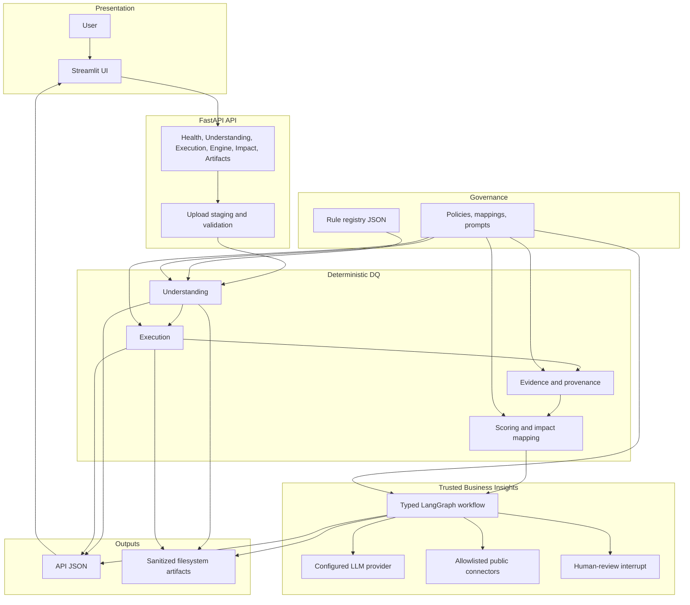

The Business Impact path in the diagram describes implemented modules, but the API-to-coordinator composition edge is missing at runtime.

| Component/Layer | Purpose | Key responsibilities | Inputs | Outputs | Main files | Dependencies | Status |
|---|---|---|---|---|---|---|---|
| Streamlit | User workflow | Upload, configure, invoke, render, download | Files/forms | UI state | `streamlit_app.py`, `ui/*.py` | Streamlit, httpx | Implemented; Impact action cannot complete |
| FastAPI | HTTP boundary | Validation, staging, routing, error envelopes | Multipart/JSON | JSON/files | `app/main.py`, `app/api/routes/*` | FastAPI | Implemented |
| Understanding | Profile and plan | Streaming profile, metadata, domains, signals, rule applicability | CSV/dictionary/rules | `UnderstandingResult`/`UnderstandingOutput` | `app/understanding/*`, `app/services/understanding.py` | pandas, openpyxl | Implemented |
| Execution | Run DQ rules | Aggregation, features, seven handlers, evidence, artifacts | Understanding + same CSV | `ExecutionOutput` | `app/execution/*` | pandas | Implemented |
| Evidence | Sanitize observations | Normalize evidence, provenance, co-occurrence | Execution evidence | Fact pack | `app/business_impact/evidence/*` | Pydantic | Implemented module, not composed |
| Scoring | Technical DQ scoring | Normalize, rule/aggregate scores, confidence | Execution metrics + policies | 0–100 score contracts | `app/business_impact/scoring/*` | JSON policies | Implemented module, not composed |
| Business Impact | Governed insight | Map impact, public research, citations, LLM, review | Sanitized facts/context | `BusinessImpactOutput` | `app/business_impact/*` | LLM, network, LangGraph | Partially implemented |
| Artifacts | Compact persistence | Atomic/run-scoped output and safe downloads | Results | JSON/CSV files | storage writers, `artifacts.py` | Filesystem | Implemented; Impact unreachable |
| Observability | Basic readiness/errors | Health/readiness, structured safe errors | Runtime state | health JSON | `health.py` | None | Partial; no metrics/tracing |

## 5. End-to-End Processing Flow

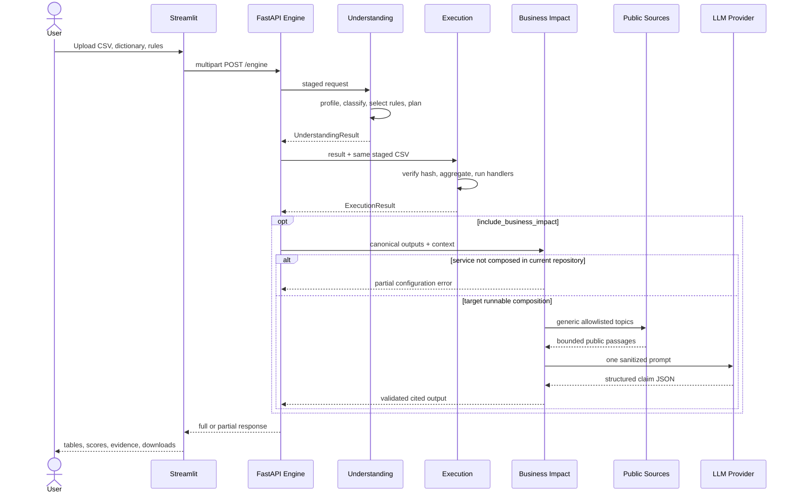

1. FastAPI stages uploads in a request-scoped temporary directory and validates size, suffix, ZIP paths, counts, and rule mode (`app/api/routes/_uploads.py`).
2. Understanding streams the CSV and constructs provenance, profile, metadata knowledge, domains, relationships, signals, applicability, and execution plan (`UnderstandingCoordinator.run()`).
3. Optional Understanding enrichment makes one LLM call after deterministic processing.
4. Execution checks the uploaded CSV SHA-256 against Understanding provenance before reading it.
5. `AggregationResolver` validates time grain, dimensions, filters, cardinality, and sensitive/free-text restrictions.
6. `ExecutionCoordinator.run()` processes chunks sequentially, extracts features, accumulates handler state, and finalizes seven rule outputs and bounded evidence.
7. Optional sampled Execution LLM enrichment is one post-execution request; it is separate from deterministic metrics.
8. The Engine optionally attempts Business Impact. It preserves Understanding and Execution if Impact fails (`business_impact_error`).
9. Current Business Impact standalone execution stops at the missing `app.state.business_impact_service` and returns 503.
10. Results are synchronous HTTP responses. Blocking work is moved to Starlette's thread pool; there is no job queue.
11. Intermediate uploads are temporary; configured artifacts persist on local disk. Graph checkpoint persistence is designed but not wired.

## 6. Layer-by-Layer Detailed Design

### 6.1 Data Ingestion and API Layer

#### A. Purpose and responsibilities

Owns HTTP validation, upload staging, response models, compatibility paths, and safe exception translation. It excludes rule algorithms and direct UI rendering. Upstream is Streamlit/API callers; downstream services are Understanding, Execution, Engine, and Business Impact.

#### B. Component flow diagram

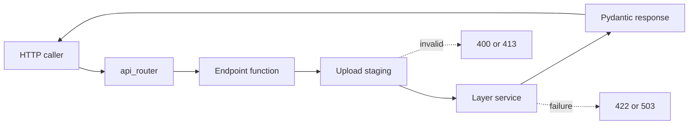

#### C. Component-level design

| Component/Class/Module | Purpose | Core logic | Important methods | Inputs | Outputs | Dependencies | Error handling | Source File |
|---|---|---|---|---|---|---|---|---|
| `app` | ASGI application | CORS, router, compatibility routes | FastAPI startup declarations | HTTP | OpenAPI/HTTP | FastAPI | Framework handlers | `app/main.py` |
| `_uploads` | Safe staging | Size limits, suffixes, safe ZIP extraction | `stage_understanding_inputs()` | Uploads | staged paths/hashes | tempfile, zipfile | 400/413 safe codes | `app/api/routes/_uploads.py` |
| Response models | Public contracts | `extra="forbid"`, typed envelopes | Pydantic validation | JSON | serialized JSON | Pydantic v2 | 422 validation | `app/models/responses.py` |

#### D. Input contract

Representative Engine multipart fields:

```json
{
  "sample_csv": "<binary CSV>",
  "metadata_dictionary": "<binary XLSX>",
  "rules_archive": "<binary ZIP>",
  "persist_artifacts": true,
  "aggregation_json": "{\"time\":{\"grain\":\"month\",\"column\":\"intrct_ts\"}}",
  "selected_rule_ids_json": "[\"fill_rate\"]",
  "llm_enabled": false,
  "include_business_impact": false
}
```

| Field | Required | Type/default | Validation |
|---|---:|---|---|
| `sample_csv` or deprecated `file` | Yes | Upload | Exactly one; `.csv`; max 5 GiB default |
| `metadata_dictionary` | Yes | Upload | CSV/XLS/XLSX/XLSM; max 50 MiB |
| `rule_files` xor `rules_archive` | Yes | repeated JSON or ZIP | Exactly one mode; 500 files; 2 MiB each; 100 MiB expanded |
| `aggregation_json` | No | JSON string `{}` | `AggregationRequest` |
| `include_business_impact` | No | Boolean `false` | Requires `impact_llm_provider` when true |

Invalid example: both `rule_files` and `rules_archive`; expected HTTP 400 with `detail.code = RULE_INPUT_MODE_INVALID`.

#### E. Output contract

```json
{
  "request_id": "1",
  "status": "completed",
  "understanding": {"Profile": {}, "Rules": {}, "output": {}},
  "execution": {"Observed_Results": {}, "output": {}},
  "business_impact": null,
  "business_impact_error": null
}
```

Pydantic validation errors use FastAPI's standard HTTP 422 `detail` array. Service failures generally use `{"detail":{"code":"...","message":"..."}}`.

#### F. Detailed processing logic

Uploaded names are reduced to safe basenames; ZIP members are rejected for traversal and non-JSON content. Files are hashed during staging. Endpoint functions use `run_in_threadpool()` for synchronous services. There is no request authentication, per-user isolation, idempotency store, or application rate limiter.

#### G. Class and interface design

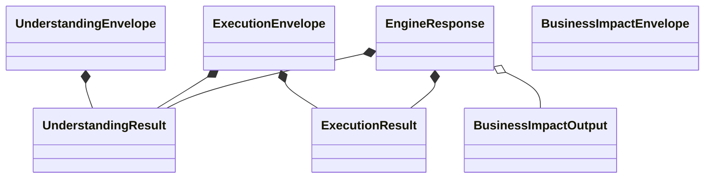

#### H. Configuration

| Configuration Key | Location | Default | Expected values | Runtime effect | Safe tuning guidance |
|---|---|---:|---|---|---|
| `UNDQ_MAX_CSV_UPLOAD_BYTES` | environment | 5 GiB | positive integer | upload cap | Lower for public/shared deployments |
| `UNDQ_UPLOAD_CHUNK_BYTES` | environment | 1 MiB | positive integer | staging I/O chunk | 1–8 MiB typical |
| `UNDQ_CORS_ORIGINS` | environment | localhost:8501 | comma-separated origins | browser access | Explicit trusted origins only |

#### I. Advantages, limitations, and trade-offs

Advantages are strict Pydantic models, bounded uploads, safe ZIP handling, and one canonical route implementation reused by compatibility paths. Limitations are synchronous execution, no auth, local temporary staging, and inconsistent error envelope shapes. Large upload limits increase disk and denial-of-service exposure.

#### J. Extension points

Add a route under `app/api/routes/`, include it in `app/api/router.py`, define contracts in `app/models/responses.py`, and keep business logic in `app/services/`. Add tests with `TestClient` and ensure upload limits remain in `app/core/config.py`.

### 6.2 Understanding Layer

#### A. Purpose and responsibilities

Profiles source structure and quality signals, joins metadata knowledge, classifies domains, loads governed rules, determines applicability, and creates an execution plan. It does not execute DQ handlers or calculate final scores.

#### B. Component flow diagram

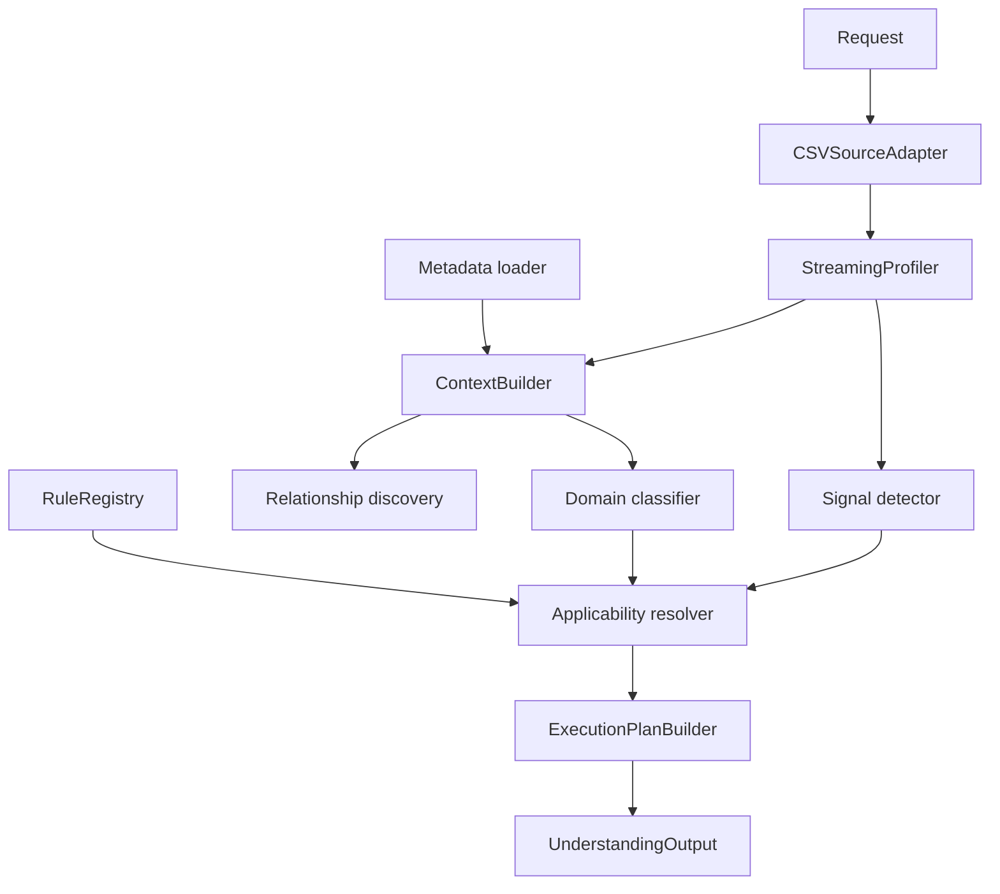

#### C. Component-level design

| Component/Class/Module | Purpose | Core Logic | Important Methods | Inputs | Outputs | Dependencies | Error Handling | Source File |
|---|---|---|---|---|---|---|---|---|
| `CSVSourceAdapter` | Chunked source | Inspect schema; yield pandas chunks | `inspect()`, `iter_chunks()` | CSV path | chunks/metadata | pandas | typed source errors | `app/understanding/source_adapters/csv_adapter.py` |
| `StreamingProfiler` | Bounded profile | Accumulators per chunk | `profile()` | adapter | `DatasetProfile` | accumulators | `ProfilingError` | `app/understanding/profiling/profiler.py` |
| `RuleRegistry` | Dynamic rules | recursive JSON load and validation | `load()` | rule directory | rule definitions/fingerprint | Pydantic | duplicate/invalid rejection | `app/understanding/rules/registry.py` |
| `UnderstandingCoordinator` | Orchestration | deterministic ordered stages | `run()` | `UnderstandingRunRequest` | `UnderstandingOutput` | all above | safe coordinator error | `app/understanding/coordinator.py` |

#### D. Input contract

Input is multipart, documented in 6.1. `UnderstandingSourceRequest` includes paths, original names, source ID/version, run ID, dictionary version, rule archive provenance, and persistence flag. File paths are internal only.

#### E. Output contract

```json
{
  "understanding": {
    "Profile": {"status":"completed","message":"...","input_file":"sample.csv","details":{"row_count":8,"column_count":60,"columns":[]}},
    "Rules": {"status":"completed","message":"...","input_file":"rules.zip","details":{"selected_rules":[]}},
    "run_id":"run-...",
    "status":"completed",
    "input_provenance":{},
    "domains":[],
    "relationships":[],
    "dq_signals":[],
    "rule_applicability":[],
    "execution_plan":{},
    "llm_insights":[],
    "artifact_references":{},
    "warnings":[],
    "output":{}
  }
}
```

`output` is the canonical `UnderstandingOutput` now populated by `_to_public_result()`; it is optional in the public model for migration.

#### F. Detailed processing logic

Profiling uses Welford-style numeric statistics and bounded string/date accumulators. Source order is not preserved by default, relationships are capped, and raw samples are disabled in production policy. Domain classification uses configured ontology and metadata hints. Signal policies create measured, unavailable, or not-evaluated observations. Rule applicability combines selectors and advertised capabilities; the plan topologically orders dependencies. Optional LLM enrichment runs after deterministic output and cannot modify the plan.

#### G. Class and interface design

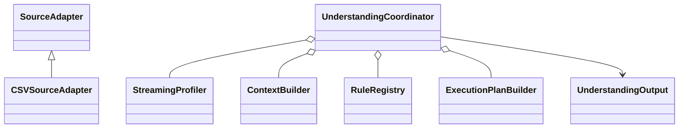

#### H. Configuration

| Configuration Key | Location | Default | Expected values | Runtime Effect | Safe Tuning Guidance |
|---|---|---:|---|---|---|
| `runtime.chunk_size_rows` | `profiling_config.json` | 10000 | positive | memory/throughput | Benchmark 5k–100k |
| `runtime.max_worker_threads` | same | 4 | positive | future/parallel stages | Current CSV profiling remains primarily serial |
| Rule parameters | `config/understanding/rules/*.json` | per rule | schema-bound | applicability/thresholds | Version and review changes |

#### I. Advantages, limitations, and trade-offs

Streaming and bounded state improve safety; dynamic rule files support governance. Metadata/domain inference can be uncertain, and relationship discovery is heuristic. The public model duplicates compatibility (`Profile`, `Rules`) and canonical `output`, creating contract debt.

#### J. Extension points

Add a source adapter implementing `SourceAdapter`; add ontology entries under `config/understanding`; add a rule JSON and, if executable, a matching handler/capability. Extend Pydantic models with backward-compatible optional fields and update artifact serialization/tests.

### 6.3 Execution Layer

#### A. Purpose and responsibilities

Executes the Understanding plan against the same verified CSV, produces aggregate metrics and redacted evidence, and optionally writes artifacts. It excludes business-impact scoring and external research.

#### B. Component flow diagram

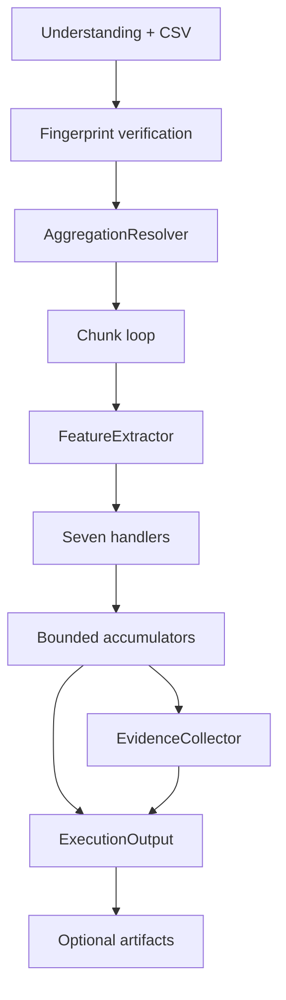

#### C. Component-level design

| Component/Class/Module | Purpose | Core Logic | Important Methods | Inputs | Outputs | Dependencies | Error Handling | Source File |
|---|---|---|---|---|---|---|---|---|
| `AggregationResolver` | Safe grouping | Resolve time/dimension/filter policy | `resolve()` | request/profile | resolved spec | policy JSON | rejects cardinality/sensitive fields | `app/execution/aggregation/resolver.py` |
| `FeatureExtractor` | Shared features | transcript/token/topic/PII features | `extract()` | chunk | feature batch | regex/config | bounded warnings | `app/execution/features/extractor.py` |
| `HandlerRegistry` | Rule dispatch | canonical check → handler | registry methods | plan step | handler | seven handlers | missing handler → pending/failure | `app/execution/handlers/registry.py` |
| `ExecutionCoordinator` | Chunk orchestration | process/finalize/summarize | `run()` | request/output/adapter | `ExecutionOutput` | above | partial result policy | `app/execution/coordinator.py` |

#### D. Input contract

```json
{
  "understanding_json":"<serialized UnderstandingResult>",
  "aggregation_json":"{\"time\":{\"grain\":\"month\",\"column\":\"intrct_ts\"},\"dimensions\":[{\"column\":\"intrct_drct\",\"alias\":\"direction\"}],\"include_overall\":true}",
  "execution_options_json":"{\"chunk_size\":10000,\"parallel_workers\":1,\"max_total_evidence\":1000}",
  "selected_rule_ids_json":"[\"fill_rate\",\"privacy_detection\"]"
}
```

`sample_csv` is also required. Rule aliases are normalized by `app/execution/rule_ids.py`.

#### E. Output contract

`ExecutionOutput` contains `run_id`, `understanding_run_id`, status, source, aggregation, execution plan ID, registry fingerprint, summary, metric availability, rule results/groups/metrics, evidence collections, warnings, errors, and artifact references. A partial result preserves completed rule outputs.

#### F. Detailed processing logic

Rules currently implemented are fill rate, topic distribution/drift inputs, speaker-tag validation, spelling/unknown-token rate, mistranslation lexicon rate, PII-pattern record rate, and speech words-per-minute. Overall and grouped accumulators are separate. Evidence stores salted `sha256:` fingerprints and safe metadata, never raw matched PII. The coordinator counts completed/skipped/failed rules and derives `completed`, `completed_with_warnings`, or `partial`.

#### G. Class and interface design

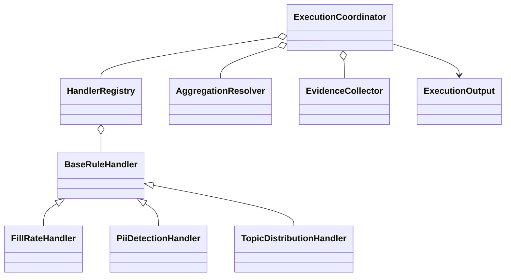

#### H. Configuration

| Configuration Key | Location | Default | Expected values | Runtime Effect | Safe Tuning Guidance |
|---|---|---:|---|---|---|
| `runtime.parallel_workers` | `execution_config.json` | 1 | 1–64 model bound | declared worker count | Implementation is effectively sequential; keep 1 |
| `bounded_state.max_total_evidence` | same | 1000 | nonnegative | memory/artifact evidence | Lower for large group counts |
| `dimensions.maximum_groups` | `aggregation_policy.json` | 5000 | positive | group explosion cap | Reduce under memory pressure |
| `llm_sampling.maximum_samples` | `llm_sampling_policy.json` | 24 | bounded integer | optional semantic sample size | Keep small; one request only |

#### I. Advantages, limitations, and trade-offs

Provenance binding and bounded aggregation are strong controls. Regex/lexicon rules favor explainability over semantic recall. CSV parsing and handler processing are synchronous. `parallel_workers` is modeled but does not provide a process pool. Grouped cardinality can still be expensive up to policy limits.

#### J. Extension points

Create a handler subclass under `app/execution/handlers/`, register it in `HandlerRegistry`, add canonical mappings in `rule_ids.py`, add a rule JSON and feature/config support, then integrate its metric into Business Impact catalogs and UI tables.

### 6.4 Evidence and Provenance Layer

#### A. Purpose and responsibilities

Converts `ExecutionOutput.evidence` and metrics into sanitized, bounded internal facts with run/plan/registry provenance. It does not reopen CSV input or infer causality.

#### B. Component flow diagram

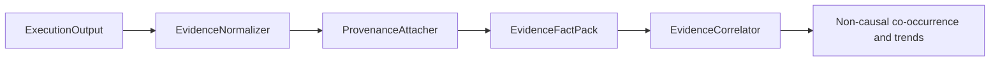

#### C. Component-level design

| Component/Class/Module | Purpose | Core Logic | Important Methods | Inputs | Outputs | Dependencies | Error Handling | Source File |
|---|---|---|---|---|---|---|---|---|
| `EvidenceNormalizer` | Normalize evidence | validate fingerprint, IDs, counts, forbidden metadata | `normalize()` | Execution evidence | normalized evidence | evidence policy | reject unsafe metadata | `app/business_impact/evidence/normalizer.py` |
| `EvidenceProvenanceAttacher` | Traceability | attach run/plan/registry/rule versions | provenance methods | normalized evidence | provenance | Execution contract | mismatch errors | `provenance.py` |
| `EvidenceCorrelator` | Aggregate patterns | co-occurrence and persistence | correlation methods | fact pack | candidates | no LLM | explicitly non-causal | `correlator.py` |

#### D. Input contract

Input is `ExecutionOutput`; an evidence item has `evidence_id`, rule/step IDs, `sha256:<64 hex>` row fingerprint, failure type, occurrence count, and safe metadata.

#### E. Output contract

`EvidenceFactPack` carries bounded `InternalFact` entries, observed/retained/dropped counts, truncation state, and deterministic provenance. Raw source rows and matches are absent.

#### F. Detailed processing logic

The normalizer rejects invalid fingerprints and metadata keys matching transcript, raw PII, identifiers, credentials, system/path/column terms. Ordering is deterministic. Overflow retains policy-prioritized evidence and records truncation. Correlator output is labeled non-causal.

#### G. Class and interface design

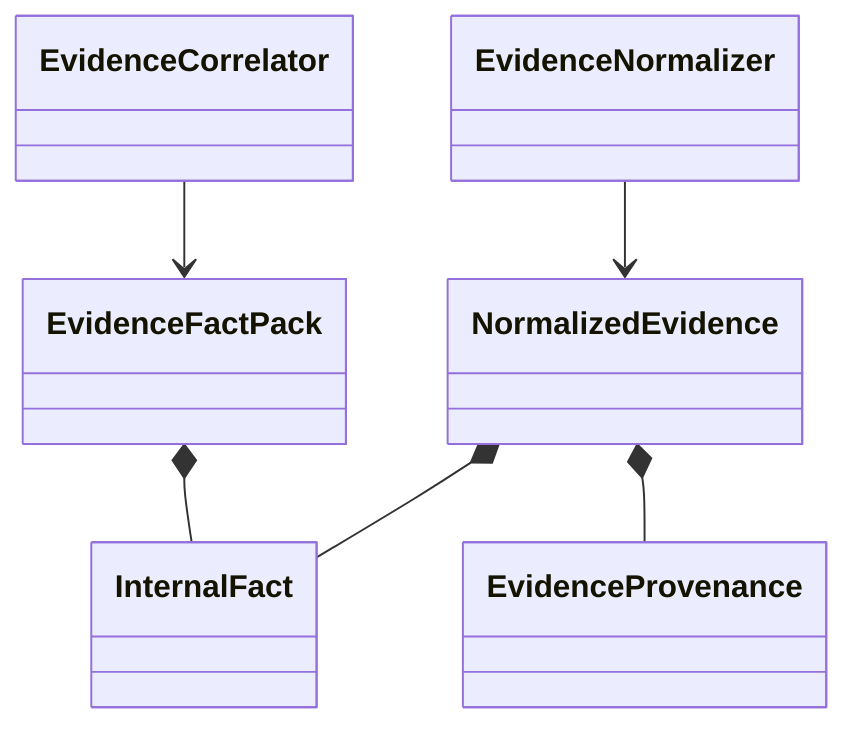

#### H. Configuration

| Configuration Key | Location | Default | Expected values | Runtime Effect | Safe Tuning Guidance |
|---|---|---:|---|---|---|
| `maximum_facts` | `evidence_policy.json` | 200 | positive | fact-pack cap | Size against prompt/state limits |
| `maximum_normalized_evidence` | same | 200 | positive | evidence cap | Keep aligned with facts |
| `maximum_fact_summary_characters` | same | 1000 | positive | text bound | Avoid increasing without disclosure review |

#### I. Advantages, limitations, and trade-offs

Strong sanitization and provenance reduce leakage risk. Pattern-based forbidden-key enforcement can create false positives/negatives. Correlation is aggregate-only and does not establish root cause.

#### J. Extension points

Extend `evidence/models.py` conservatively, update `evidence_policy.json`, implement normalization in `normalizer.py`, and add disclosure tests. Never pass new raw fields to graph state or connectors.

### 6.5 Scoring Layer

#### A. Purpose and responsibilities

Normalizes approved primary DQ metrics to 0–100, aggregates explicit rule weights, and computes assessment completeness confidence. It does not estimate business loss or let the LLM alter scores.

#### B. Component flow diagram

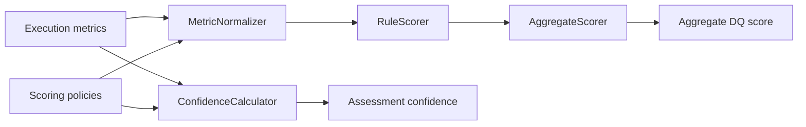

#### C. Component-level design

| Component/Class/Module | Purpose | Core Logic | Important Methods | Inputs | Outputs | Dependencies | Error Handling | Source File |
|---|---|---|---|---|---|---|---|---|
| `MetricNormalizer` | Metric → score | primary metric selection and formulas | `normalize()` | `ExecutionOutput` | metric scores/skips | scoring/catalog JSON | explicit not-scored reasons | `metric_normalizer.py` |
| `RuleScorer` | Rule rollup | avoid overall/group overlap | scoring method | metric scores | `RuleQualityScore` | policy | null on no eligible metric | `rule_scorer.py` |
| `AggregateScorer` | Weighted total | coverage and renormalization | aggregate method | rule scores | `AggregateQualityScore` | weights | null below 0.7 coverage | `aggregate_scorer.py` |
| Confidence calculator | Completeness confidence | weighted available factors | calculate method | coverage/evidence/provenance | `AssessmentConfidence` | confidence policy | null below 0.75 factor coverage | `confidence.py` |

#### D. Input contract

`RawMetricObservation` preserves rule/version, metric name/value/unit, numerator, denominator, threshold, outcome, period/dimensions, aggregation key, availability, and source fact ID.

#### E. Output contract

Scores include stable IDs, formula/policy versions, 0–100 nullable score, band, availability, configured/effective weight, and rationale. Aggregate score separately records coverage and excluded rule IDs.

#### F. Detailed processing logic and formulas

For higher-is-better with fail threshold \(L\) and pass threshold \(U\):

\[
S(x)=\operatorname{clamp}_{0}^{100}\left(100\frac{x-L}{U-L}\right)
\]

For lower-is-better:

\[
S(x)=\operatorname{clamp}_{0}^{100}\left(100\frac{U-x}{U-L}\right)
\]

Inside-range returns 100 within the pass interval and declines linearly to zero at outer warning bounds. Example: fill rate 0.80 with `L=0.70`, `U=0.90` scores \(100(0.80-0.70)/0.20=50\).

The aggregate is \(A=\sum_i \hat w_i S_i\), where \(\hat w_i=w_i/\sum_{j\in available}w_j\). It is null if available configured weight / applicable weight is below 0.70. Confidence is a weighted sum of available rule, metric, evidence, provenance, and external-context coverage factors; it is null below 0.75 factor-weight coverage.

#### G. Class and interface design

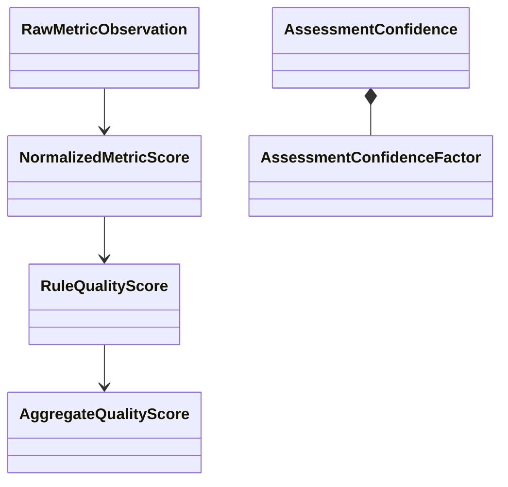

#### H. Configuration

| Configuration Key | Location | Current | Expected values | Runtime Effect | Safe Tuning Guidance |
|---|---|---:|---|---|---|
| `minimum_coverage_ratio` | `scoring_policy.json` | 0.70 | 0–1 | score-null boundary | Raise for assurance; version change |
| Rule weights | same | sum 1.0 | each 0–1 | contribution | Never add a rule without explicit reviewed weight |
| Score bands | same | 90/75/60/40/0 | descending boundaries | labels | Align to governance, not desired output |
| Confidence coverage | `confidence_policy.json` | 0.75 | 0–1 | confidence-null boundary | Raise for stronger evidence requirements |

#### I. Advantages, limitations, and trade-offs

Versioned deterministic formulas are auditable. Linear normalization is simple but encodes policy judgment and may overstate precision. Weight renormalization preserves comparability but can hide absent low-weight rules; coverage remains visible to mitigate this.

#### J. Extension points

Add the canonical rule to `rule_metric_catalog.json`, an explicit weight and formula in `scoring_policy.json`, update `app/execution/rule_ids.py`, and add tests for boundaries, unavailable metrics, grouped overlap, and coverage failure.

### 6.6 Trusted Business Insights / Business Impact Layer

#### A. Purpose and responsibilities

Maps deterministic technical findings to governed non-causal impact hypotheses, retrieves public material through allowlisted connectors, makes one LLM call for structured claims, validates citations/disclosure, and pauses risky outputs for review. It excludes raw source access and quantified losses.

#### B. Component flow diagram

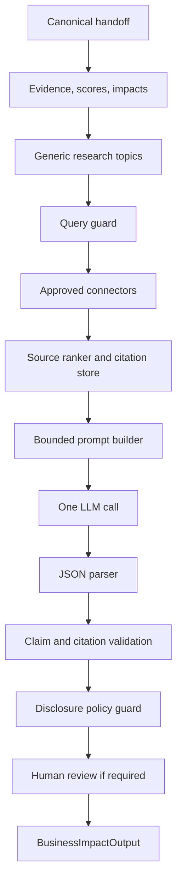

#### C. Component-level design

| Component/Class/Module | Purpose | Core Logic | Important Methods | Inputs | Outputs | Dependencies | Error Handling | Source File |
|---|---|---|---|---|---|---|---|---|
| `BusinessImpactCoordinator` | Sole orchestrator | deterministic runner then trusted graph | `run()` | run request | output | injected runners | graph failure → partial | `coordinator.py` |
| `TrustedBusinessInsightGraphBuilder` | Graph topology | nodes, conditional routes, one LLM attempt | `compile()` | adapters/policy | compiled graph | LangGraph | safe build errors | `graph/builder.py` |
| `ConnectorRegistry` | Approved connectors | configured-only registration | registry methods | source policy | connector | connector mismatch rejection | `external_context/registry.py` |
| `HttpPublicConnector` | Public retrieval | fixed endpoint, allowlist, retry, rate/size bounds | `retrieve()` | generic topic | documents/passages | urllib | bounded failed provenance | `connectors/__init__.py` |
| `TrustedInsightGenerator` | LLM boundary | build, one call, parse | `generate()` | facts + citations | claims/error | `generate_text()` | partial on provider/parser error | `generate_insight.py` |
| `HumanReviewNode` | Publication gate | critical/regulatory/novel/low-confidence triggers | `require_review()` | output | token/reasons | LangGraph optional | interrupt or payload | `human_review.py` |

#### D. Input contract

```json
{
  "understanding": {"contract_version":"1.0","run_id":"run-1","status":"completed","source":{},"profile":{},"input_provenance":{},"execution_plan":{}},
  "execution": {"contract_version":"1.0","run_id":"exec-1","understanding_run_id":"run-1","status":"completed","source":{},"aggregation":{},"summary":{},"rule_results":[],"evidence":[]},
  "business_context": {
    "context_id":"context-consumer-services",
    "context_schema_version":"1.0",
    "business_capabilities":["customer service analytics"],
    "service_channels":["voice"],
    "regulated_domains":["consumer financial services"],
    "approved_impact_categories":["data_integrity"]
  },
  "options":{"persist_artifacts":false,"external_context_required":true},
  "llm":{"provider":"ollama","model":"llama3.1:8b","request_id":"impact-001","failure_mode":"partial"}
}
```

The abbreviated nested objects above must actually satisfy full `UnderstandingOutput` and `ExecutionOutput`; clients should pass prior canonical API outputs rather than handcraft them. Extra fields are forbidden.

#### E. Output contract

```json
{
  "request_id":"impact-001",
  "status":"partial",
  "business_impact":{
    "contract_version":"1.0",
    "run_id":"impact-...",
    "understanding_run_id":"run-1",
    "execution_run_id":"exec-1",
    "status":"partial",
    "fact_pack":{"facts":[]},
    "normalized_evidence":[],
    "normalized_metric_scores":[],
    "rule_scores":[],
    "aggregate_score":null,
    "assessment_confidence":null,
    "impact_hypotheses":[],
    "root_cause_candidates":[],
    "external_context":null,
    "citations":[],
    "insight_claims":[],
    "recommendations":[],
    "llm_provider":null,
    "errors":[]
  }
}
```

In the delivered runtime, no envelope is produced because the service is not registered; HTTP 503 is returned first.

#### F. Detailed processing logic

The intended order is deterministic scoring before external/LLM work. Research topics come only from `external_topic_mapping.json`; direct URLs and internal metrics/identifiers are rejected. Connectors retrieve fixed landing endpoints—not a search API—and extract the first bounded sentences. Publication timestamps are generally `null`, reducing freshness assurance. Sources are deduplicated by canonical URL/content hash. The LLM receives bounded sanitized facts plus verified passages and may return IDs, not URLs. Unsupported/fabricated citations are rejected. Critical bands, regulatory text, confidence below 0.6, novel recommendations, and selected policy warnings require review.

**Operational mismatch:** no concrete classes implement and wire the `DeterministicAssessmentRunner` and `TrustedGraphRunner` protocols into a `BusinessImpactCoordinator`; no node adapter mapping/checkpointer is created; `app.state.business_impact_service` is never assigned. `langgraph` is absent from `requirements.txt`.

#### G. Class and interface design

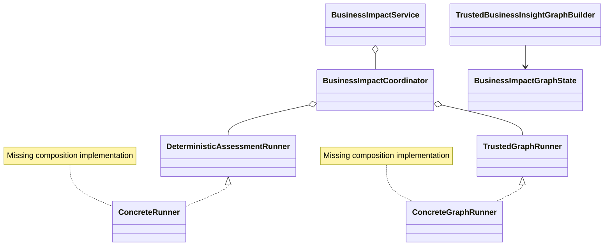

#### H. Configuration

| Configuration Key | Location | Current | Expected values | Runtime Effect | Safe Tuning Guidance |
|---|---|---:|---|---|---|
| `maximum_llm_calls_per_run` | `graph_policy.json` | 1 | exactly 1 | LLM call limit | Do not increase without architecture review |
| `maximum_documents/passages/citations` | graph/evidence policy | 40/80/40 | positive bounded | memory/prompt size | Coordinate all limits |
| `minimum_verified_citations_for_completed_report` | `citation_policy.json` | 1 | positive | completion | Regulatory claims require 2 |
| Source hosts/types | `source_registry.json` | seven registries | explicit allowlists | retrieval boundary | Add only approved primary domains |
| Provider/model | request + env | user selected | registered providers | final narrative | Provider must be enterprise-approved |

#### I. Advantages, limitations, and trade-offs

The contracts strongly separate internal facts from connector input, preserve URLs outside the LLM, and keep scoring deterministic. Current connectors fetch generic landing pages and do not query topic-specific document APIs. Publication date extraction and content relevance are weak. Human review has contracts but no reviewer endpoint/UI/persistent identity. Most importantly, the layer is not runnable without composition work.

#### J. Extension points

Implement a composition module that loads all policies, constructs deterministic components, builds node adapters, compiles the graph with a sanitized checkpointer, constructs the coordinator/service, and registers it during FastAPI lifespan. Add source connectors by implementing `ExternalContextConnector`, registering policy/source IDs, and testing redirects/size/retries. Add providers only through `app/llm_provider.py`.

### 6.7 Frontend / Presentation Layer

#### A. Purpose and responsibilities

Provides a Streamlit workflow for uploads, DQ configuration, result views, Business Context, provider selection, citations, and artifacts. It calls HTTP only and deliberately does not import backend internals.

#### B. Component flow diagram

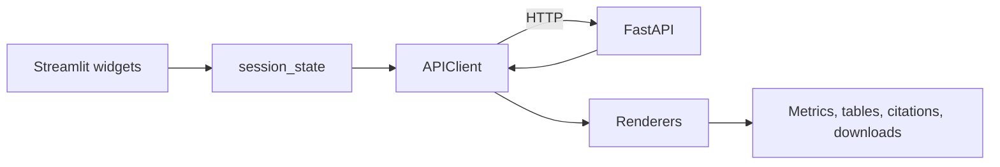

#### C. Component-level design

| Component/Class/Module | Purpose | Core Logic | Important Methods | Inputs | Outputs | Dependencies | Error Handling | Source File |
|---|---|---|---|---|---|---|---|---|
| `APIClient` | HTTP adapter | multipart/JSON calls | `ready()`, `understanding()`, `execution()`, `business_impact()` | bytes/forms | dictionaries/bytes | httpx | `APIClientError` | `ui/api_client.py` |
| Renderers | Result views | tables, metrics, links | `render_*()` | API dictionaries | Streamlit elements | Streamlit | tolerant `.get()` | `ui/renderers.py` |
| App | Workflow | uploads, forms, session state, actions | top-level script | user input | page | pandas/Streamlit | visible messages | `streamlit_app.py` |

#### D. Input contract

UI accepts CSV, XLSX dictionary, and ZIP registry. Sidebar accepts optional sampled-LLM provider/model and aggregation fields. The Business Impact form requires provider/model selection and accepts governed comma-separated context categories.

#### E. Output contract

The UI displays profile counts, columns, domains, signals, rule applicability, per-check metrics, grouped results, optional sampled LLM assessment, aggregate score/coverage/confidence, evidence, impact hypotheses, root-cause candidates, claims, citations, recommendations, warnings/errors, and artifact download buttons.

#### F. Detailed processing logic

The CSV preview reads at most 100 rows. Successful responses are stored in `st.session_state`. Business Impact extracts canonical `understanding.output` and `execution.output`; it blocks locally if absent. HTTP timeout defaults to 300 seconds.

#### G. Class and interface design

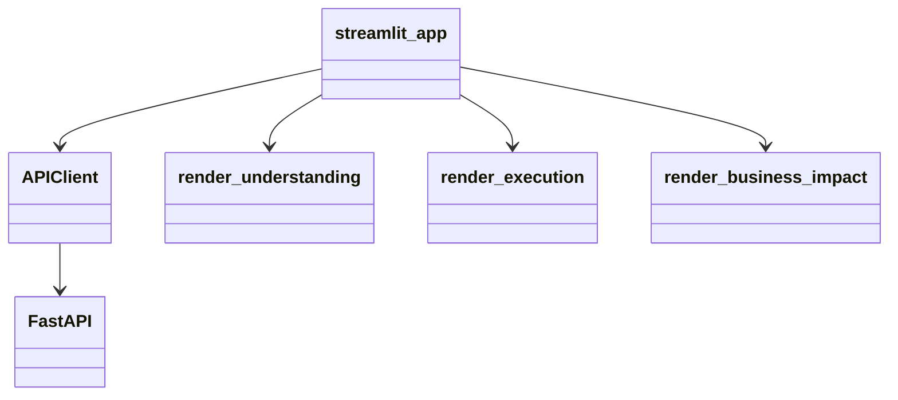

#### H. Configuration

| Configuration Key | Location | Default | Expected values | Runtime Effect | Safe Tuning Guidance |
|---|---|---:|---|---|---|
| `UNDQ_API_BASE_URL` | env | `http://127.0.0.1:8000` | trusted URL | backend target | Use internal TLS endpoint in production |
| `UNDQ_UI_HTTP_TIMEOUT_SECONDS` | env | 300 | positive seconds | request timeout | Align with API/proxy limits |

#### I. Advantages, limitations, and trade-offs

HTTP-only separation is clean and testable. The app is a single script with limited navigation and no role-based controls. Links are rendered directly from validated API citations, but Streamlit itself does not revalidate domains. There is no review-decision UI.

#### J. Extension points

Add API methods only in `ui/api_client.py`, views in `ui/renderers.py`, and actions in `streamlit_app.py`. Keep backend imports prohibited. A reviewer page requires new authenticated backend endpoints first.

### 6.8 Shared Configuration, Models, Utilities, and Infrastructure

#### A. Purpose and responsibilities

Centralizes environment settings, contracts, rule IDs, governed JSON, prompts, provider adapters, and storage helpers. It excludes deployment orchestration.

#### B. Component flow diagram

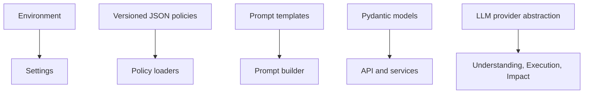

#### C. Component-level design

| Component/Class/Module | Purpose | Core Logic | Important Methods | Inputs | Outputs | Dependencies | Error Handling | Source File |
|---|---|---|---|---|---|---|---|---|
| `Settings` | API/upload config | dotenv/env parsing | construction | env | immutable settings | dotenv | fail-fast invalid ints | `app/core/config.py` |
| LLM providers | Provider abstraction | HTTP POST adapters | `generate_text()` | prompt/options | text | httpx | `LLMProviderError` | `app/llm_provider.py` |
| Rule ID mapping | Canonicalization | alias map | normalize methods | ID | canonical ID | none | ValueError | `app/execution/rule_ids.py` |
| Prompt files | LLM policy | strict JSON and support constraints | template text | facts/passages | prompt | builder | parser rejects invalid output | `config/business_impact/prompts/*` |

#### D. Input contract

Configuration JSON is versioned and generally validated by layer-specific loaders. Environment variables are strings converted at startup. Secrets must stay in `.env` or deployment secret stores; `.env` is git-ignored.

#### E. Output contract

Shared models serialize through Pydantic v2 in JSON mode. Most contract bases forbid extras and strip whitespace.

#### F. Detailed processing logic

Provider selection is request-scoped where supplied, otherwise `LLM_PROVIDER`. Ollama uses deterministic seed, temperature 0, JSON format, and configured context/output limits. Launchpad and Document Intelligence are generic HTTP adapters; the latter's payload is explicitly marked for adjustment to the actual API.

#### G. Class and interface design

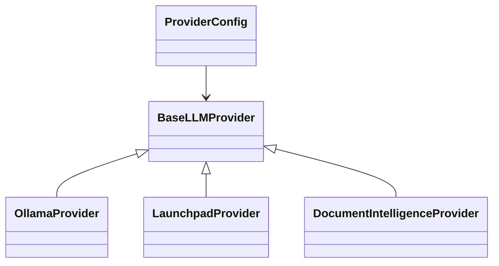

#### H. Configuration

Material keys are cataloged in sections 9, 10, and the appendix.

#### I. Advantages, limitations, and trade-offs

Versioned files are auditable and portable. There is no centralized typed settings library for all variables, and multiple modules read environment variables independently. JSON cross-file consistency is validated only when components are constructed—which currently does not occur for Business Impact.

#### J. Extension points

Prefer versioned schema-compatible JSON additions; add loader validation and tests. Add provider implementations to `PROVIDERS`, without embedding provider calls inside domain code.

## 7. API Reference

### Endpoint inventory

| Method | Route | Purpose | Request Type | Response Type | Authentication | Status Codes | Source |
|---|---|---|---|---|---|---|---|
| GET | `/health` | Liveness | none | `HealthResponse` | None | 200 | `health.py` |
| GET | `/ready` | Dependency readiness | none | `HealthResponse` | None | 200/503 | `health.py` |
| GET | `/api/v1/undq/llm/providers` | Provider names | none | dict | None | 200 | `llm.py` |
| GET | `/business-impact` | Browser status | none | `ComponentStatusResponse` | None | 200 | `business_impact.py` |
| GET | `/api/v1/undq/transcript/{understanding,execution,engine,business-impact}` | Component status | none | `ComponentStatusResponse` | None | 200 | route modules |
| POST | `/api/v1/undq/transcript/understanding` | Full Understanding | multipart | `UnderstandingEnvelope` | None | 200/400/413/422 | `understanding.py` |
| POST | `/api/v1/undq/transcript/understanding/profiling` | Profile view | multipart | `ServiceResult` | None | 200/400/413/422 | `understanding.py` |
| POST | `/api/v1/undq/transcript/understanding/rules` | Rule view | multipart | `ServiceResult` | None | 200/400/413/422 | `understanding.py` |
| POST | `/api/v1/undq/transcript/execution` | Standalone Execution | multipart | `ExecutionEnvelope` | None | 200/400/413/422 | `execution.py` |
| POST | `/api/v1/undq/transcript/engine` | Combined run | multipart | `EngineResponse` | None | 200/400/413/422 | `engine.py` |
| POST | `/api/v1/undq/transcript/business-impact` | Downstream Impact | JSON | `BusinessImpactEnvelope` | None | 200/422/503 | `business_impact.py` |
| GET | `/api/v1/undq/transcript/artifacts/{run_id}` | List Execution artifacts | path | dict | None | 200/400/404 | `artifacts.py` |
| GET | `/api/v1/undq/transcript/artifacts/{run_id}/{filename}` | Download Execution artifact | path | file | None | 200/400/404 | `artifacts.py` |
| GET | `/api/v1/undq/transcript/artifacts/business-impact/{run_id}` | List Impact artifacts | path | dict | None | 200/400/404/410/503 | `artifacts.py` |
| GET | `/api/v1/undq/transcript/artifacts/business-impact/{run_id}/{filename}` | Download Impact artifact | path | file | None | 200/404/410/503 | `artifacts.py` |
| POST | `/UnDQ/transcript/understanding/profiling` | Compatibility alias to full Understanding endpoint | multipart | `UnderstandingEnvelope` | None | same as canonical | `app/main.py` |
| POST | `/UnDQ/transcript/execution` | Compatibility alias | multipart | `ExecutionEnvelope` | None | same | `app/main.py` |
| POST | `/UnDQ/transcript/engine/` | Compatibility alias | multipart | `EngineResponse` | None | same | `app/main.py` |

No route declares headers, query parameters, or authentication. All processing routes are non-idempotent operationally: deterministic IDs may repeat, but uploads, connector calls, LLM calls, and artifact writes are not guarded by a persistent idempotency store.

### Representative commands and failure examples

```bash
curl -sS http://127.0.0.1:8000/health
curl -sS http://127.0.0.1:8000/ready

curl -X POST http://127.0.0.1:8000/api/v1/undq/transcript/understanding \
  -F 'sample_csv=@data/input/lumi_sample.csv' \
  -F 'metadata_dictionary=@data/input/lumi_metadata_dictionary.xlsx' \
  -F 'rules_archive=@data/input/rules.zip' \
  -F 'persist_artifacts=false' -o understanding.json

curl -X POST http://127.0.0.1:8000/api/v1/undq/transcript/engine \
  -F 'sample_csv=@data/input/lumi_sample.csv' \
  -F 'metadata_dictionary=@data/input/lumi_metadata_dictionary.xlsx' \
  -F 'rules_archive=@data/input/rules.zip' \
  -F 'aggregation_json={"time":{"grain":"month","column":"intrct_ts"}}' \
  -F 'persist_artifacts=false'
```

Standalone Execution requires the exact serialized `understanding` object:

```bash
jq -c '.understanding' understanding.json > understanding-body.json
curl -X POST http://127.0.0.1:8000/api/v1/undq/transcript/execution \
  -F 'sample_csv=@data/input/lumi_sample.csv' \
  -F "understanding_json=$(<understanding-body.json)" \
  -F 'aggregation_json={}'
```

Current Business Impact runtime failure:

```json
{"detail":{"code":"BUSINESS_IMPACT_NOT_CONFIGURED","message":"Business Impact service composition is not configured."}}
```

For Postman, import `postman/UnDQ_QuickCheck.postman_collection.json` and its environment, set `base_url`, and attach local files in form-data. The checked-in collections predate some Business Impact changes and must be reviewed before treating them as authoritative.

Recommended test order: health → readiness → providers → Understanding → standalone Execution → Engine without Impact → artifact list/download → Business Impact status → Business Impact POST (expect 503 until fixed) → Engine with Impact (expect preserved DQ results plus `business_impact_error`) → Streamlit.

Timeout: UI defaults to 300 seconds, LLM to 180 seconds, graph policy to 120 seconds. FastAPI/proxy timeouts are otherwise not configured in repository.

## 8. Frontend Design and Usage

Streamlit entry point is `streamlit_app.py`. The page has file uploaders, a bounded CSV preview, semantic-enrichment/provider controls, aggregation fields, run buttons, Business Context inputs, required Impact provider/model fields, result renderers, and artifact downloads. `st.session_state` retains Understanding, Execution, and Business Impact responses during the browser session. There is no server-side UI session persistence.

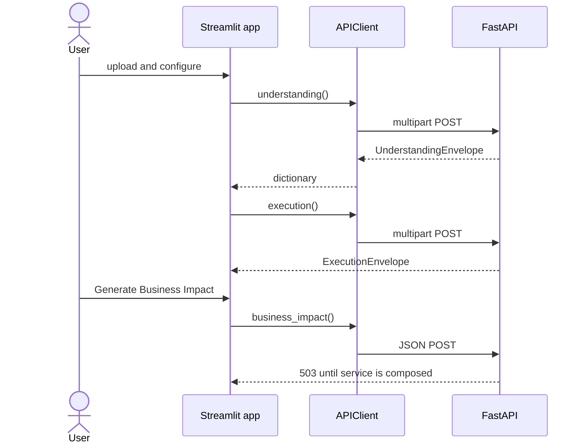

Backend endpoints are listed in section 7. Internal frontend functions are `APIClient.*` and `render_*`. User actions are upload, configure, run Understanding/Execution, generate Impact, expand result sections, follow validated citations, and download artifacts.

## 9. How to Use the Solution

### 9.1 Prerequisites

- Python 3.11+.
- `pip install -r requirements.txt`.
- Private `UNDQ_EVIDENCE_HASH_SALT`.
- Input CSV, metadata dictionary (CSV/XLS/XLSX/XLSM), and JSON rules or ZIP.
- Port 8000 backend; 8501 Streamlit.
- Optional Ollama/Launchpad/Document Intelligence service.
- For runnable Business Impact, additional code composition and the missing LangGraph dependency are prerequisites.

### 9.2 Backend setup

```bash
cd quickcheck_QC
python -m venv .venv
source .venv/bin/activate
python -m pip install --upgrade pip
pip install -r requirements.txt
cp .env.example .env
# Edit .env and replace UNDQ_EVIDENCE_HASH_SALT.
uvicorn app.main:app --host 127.0.0.1 --port 8000 --reload
```

Verify `/health`, `/ready`, `/docs`, and `/openapi.json`. Stop with Ctrl+C.

### 9.3 Frontend setup

Dependencies are in the same requirements file.

```bash
export UNDQ_API_BASE_URL=http://127.0.0.1:8000
streamlit run streamlit_app.py --server.port 8501
```

Open `http://127.0.0.1:8501`. A green sidebar readiness status verifies connectivity.

### 9.4 Backend API usage

Use the curl order in section 7. In Swagger, open `/docs`, expand a POST route, select “Try it out,” attach files, and provide JSON form fields as strings. In Postman, use `form-data` and file types, not raw JSON, for Understanding/Execution/Engine. Copy the complete `.understanding` object to standalone Execution; copy canonical `.understanding.output` and `.execution.output` to Business Impact.

### 9.5 Frontend usage

1. Upload the CSV, metadata workbook, and rules ZIP.
2. Optionally enable one sampled semantic LLM request and choose provider/model.
3. Select aggregation grain and columns.
4. Run Understanding and review domains/signals/rules.
5. Run Execution and review per-check and grouped metrics.
6. Inspect evidence only as aggregate/redacted data.
7. Complete governed Business Context and select the mandatory Impact LLM.
8. Generate Business Impact. In the delivered repository, expect a 503 until service composition is implemented.
9. After the gap is fixed, review score coverage, confidence factors, non-causal hypotheses, verified citations, and review-required flags.
10. Download manifest-approved artifacts where persistence was enabled.

### 9.6 End-to-end example

The supplied `data/input/lumi_sample.csv` contains 8 rows and 60 columns; raw row content is intentionally not reproduced here. The supplied rules ZIP contains seven versioned JSON rules. Existing Understanding sample outputs are available under `data/understanding_layer/*` and show profile/domain/signal/plan artifacts. Verified repository tests expect seven rules to execute with zero rule failures on the sample (`tests/test_operational_api.py`), but tests could not be executed in the analysis runtime because FastAPI/pytest were not installed. Static compilation passed.

Business Impact final output is unavailable from the current repository because service composition is missing. No score, citation, or trusted narrative is fabricated here.

## 10. Configuration and Result Tuning Guide

| Setting | Current Value | Location | What It Controls | Effect of Increasing | Effect of Decreasing | Recommended Range | Risk |
|---|---:|---|---|---|---|---|---|
| Profile chunk rows | 10,000 | `profiling_config.json` | memory/throughput | faster, more memory | slower, less memory | 5k–100k after benchmark | OOM at high values |
| Max dimensions | 3 | `aggregation_policy.json` | grouping breadth | richer views, group explosion | simpler output | 1–3 | memory/time |
| Max groups | 5,000 | same | group cap | more coverage | earlier rejection | 500–5,000 | resource exhaustion |
| Max evidence | 1,000 Execution; 200 Impact | execution/evidence policies | retained evidence | more context | more truncation | keep bounded | privacy/memory |
| Score coverage | 0.70 | `scoring_policy.json` | aggregate eligibility | more null scores | more scored partials | 0.70–1.00 | false assurance if low |
| Confidence factor coverage | 0.75 | `confidence_policy.json` | confidence eligibility | more null confidence | less complete confidence | 0.75–1.00 | misinterpretation |
| LLM samples | 24 | `llm_sampling_policy.json` | semantic sample | more prompt coverage | less cost | 8–24 | latency/data exposure |
| Connector retries | 2 | `source_registry.json` | transient recovery | latency/load | lower resiliency | 1–2 | throttling |
| Graph runtime | 120 s | `graph_policy.json` | workflow bound | accommodates slow LLM | faster failure | 60–180 s | proxy mismatch |

Supported profiles should be implemented as reviewed file versions, not undocumented runtime overrides:

| Profile | Supported adjustments |
|---|---|
| Strict/high-assurance | Raise minimum score/confidence coverage; reduce accepted evidence truncation; preserve citation minimums or raise them |
| Balanced/default | Current checked-in values |
| Exploratory/high-recall | Enable optional sampled LLM; broaden allowed governed dimensions within caps; do **not** lower privacy or citation controls |

No mechanism currently selects named profiles, so these are governance guidance rather than implemented profile IDs.

## 11. Rule and Check Extension Guide

1. Add a versioned rule JSON under `config/understanding/rules/` or supply it per request.
2. Define selectors, required capabilities, parameters, thresholds, evidence policy, and lifecycle.
3. Extend canonical aliases in `app/execution/rule_ids.py`.
4. Implement a `BaseRuleHandler` under `app/execution/handlers/`.
5. Register the handler in `HandlerRegistry` and advertise the capability used by applicability.
6. Extend feature extraction/config only when the handler cannot consume existing features.
7. Return `RuleMetric`, group populations, outcomes, and safe evidence using existing models.
8. Add an explicit primary metric in `config/business_impact/rule_metric_catalog.json`.
9. Add a reviewed rule weight in `scoring_policy.json`; weights must sum to 1.0.
10. Add impact mapping/recommendation/topic mapping only if governed.
11. UI generic tables usually render the new result without code; specialized charts require `ui/renderers.py`.
12. Add unit boundary tests and an Engine end-to-end test.

Illustrative, not currently existing: a `silence_ratio` rule would need a rule JSON, `SilenceRatioHandler`, registry entry, primary metric normalization, weight rebalance, mapping, and tests. Do not add only a JSON rule and claim it executes: unsupported checks become implementation pending.

## 12. Data Models and Contracts

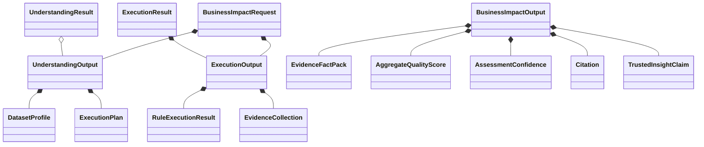

Major model locations are `app/understanding/models.py`, `app/execution/models.py`, `app/business_impact/**/models.py`, and `app/models/responses.py`. Contracts use Pydantic v2; coordinator protocols and some review/connector results use frozen dataclasses.

Contract gaps:

- Compatibility fields use capitalized `Profile`, `Rules`, and `Observed_Results`, unlike canonical snake_case.
- `UnderstandingResult` duplicates flattened data and optional `output`.
- `status` is sometimes a plain string and sometimes an enum.
- Business Context JSON Schema has conditional requirements; the Pydantic model alone does not express all schema rules, relying on `context_validator.py`.
- Business Impact output has no top-level review token/publication-status fields even though `HumanReviewNode` creates them; graph state contains review flags.
- Tests and docs still assert Business Impact is deferred/disabled, contradicting active route contracts.

## 13. Security and Privacy

| Control | Status | Repository evidence and assessment |
|---|---|---|
| Authentication | Missing | No route dependency/middleware |
| Authorization | Missing | No roles/ownership checks; artifacts are run-ID accessible |
| Input validation | Implemented | Pydantic, suffix/size limits, ZIP traversal checks |
| File upload safety | Partial | bounds and temp staging; no malware scan/content sniffing |
| PII handling | Partial | redacted features/fingerprints and no raw PII evidence; raw uploaded CSV is necessarily processed |
| Secrets | Partial | env-based and `.env` ignored; no external secret manager |
| Sensitive logging | Partial | safe error intent; no centralized redaction/log policy implementation |
| Prompt injection | Partial | bounded templates and structured JSON; public page content remains untrusted prompt material |
| LLM leakage | Partial | sampling redaction and Impact disclosure guards; provider boundary depends on deployment |
| Connector SSRF | Implemented by design | fixed connector endpoints, host/path/scheme validation, redirect revalidation |
| CORS | Implemented | explicit localhost defaults; credentials disabled |
| Rate limiting | Missing | connector-local sleep only; no API rate limit |
| Auditability | Partial | provenance/artifacts/graph traces modeled; no centralized audit sink |
| Dependency scanning | Cannot be verified | pinned core dependencies, no scanner config |

The `.env` file is ignored by git; its contents were not included in this document. Production must add authentication, tenant-scoped artifact authorization, TLS, reverse-proxy limits, malware scanning, centralized secret management, and log redaction.

## 14. Scalability, Performance, and Reliability

Verified current behavior: CSV is chunked, accumulators/evidence/groups are bounded, requests are synchronous, endpoint work runs in a thread pool, and no distributed queue/cache/database exists. Connector rate state is held per connector object and uses blocking `sleep()`. Artifacts are local filesystem files. LLM calls and public retrieval dominate tail latency. CSV parsing is serial; configured worker counts do not create distributed parallelism.

Large files can consume temporary disk up to the 5 GiB default and hold individual chunks plus accumulators in memory. Group limits cap but do not eliminate cardinality pressure. Failure isolation is good at rule and optional Impact boundaries: Business Impact failure does not erase earlier results. There is no circuit breaker, process-wide connector rate coordination, resilient checkpoint store, metrics exporter, tracing, or retention cleanup worker.

Recommended production changes are documented only in section 19 and are not current behavior.

## 15. Testing and Validation

Existing tests are two FastAPI modules: `tests/test_understanding_api.py` and `tests/test_operational_api.py`. They cover uploads, nested ZIP rules, Engine consumption, rule-mode validation, readiness, traversal, UI import isolation, seven-rule grouped execution, selection aliases, and compatibility paths. There are no checked-in Business Impact unit tests, connector mocks, scoring boundary tests, frontend tests, load tests, or coverage configuration.

The current tests are stale: they assert readiness `business_impact == "deferred"` and status `disabled`, while current code returns configuration availability and `healthy`. Static Python compilation of `app`, `ui`, and `streamlit_app.py` passed. Runtime pytest could not run in the analysis environment because pytest/FastAPI were not installed there; the repository's Windows-style `venv` was not used as evidence of a portable environment.

| Test ID | Scenario | Input | Expected Result | Layer | Priority | Automated/Manual |
|---|---|---|---|---|---|---|
| T01 | Health/readiness | GET | 200/accurate checks | API | Critical | Automated |
| T02 | Valid full sample | supplied files | seven rules, no failure | End-to-end | Critical | Automated |
| T03 | Fingerprint mismatch | different CSV | 422 mismatch | Execution | Critical | Automated |
| T04 | ZIP traversal | malicious member | 400 rejection | Ingestion | Critical | Automated |
| T05 | Oversized upload | above cap | 413 | Ingestion | High | Automated |
| T06 | High-cardinality grouping | > cap | safe rejection | Execution | High | Automated |
| T07 | Scoring boundaries | thresholds/nulls | exact/null scores | Scoring | Critical | Missing |
| T08 | Connector redirect | unapproved host | reject | External context | Critical | Missing |
| T09 | Fabricated citation | unknown ID | claim rejected | Insights | Critical | Missing |
| T10 | LLM outage | provider timeout | deterministic partial retained | Impact | Critical | Missing |
| T11 | Human review | critical/low confidence | interrupt/token | Impact | High | Missing |
| T12 | UI smoke | full workflow | correct displays/errors | Frontend | High | Manual/missing automated |
| T13 | 5 GiB boundary | large generated file | bounded memory/disk | Performance | High | Manual/load |

## 16. Deployment and Operations

Only local process deployment is documented: Uvicorn and Streamlit in separate terminals. No Dockerfile, Compose, Kubernetes, cloud manifest, CI workflow, process supervisor, database, log aggregation, metrics, or rollback automation is present. `/health` is liveness; `/ready` checks selected files and handler count but incorrectly can report ready even though Business Impact service composition is absent.

Minimum production structure: TLS ingress/API gateway; authenticated FastAPI replicas; background job queue for long runs; durable object storage; Redis/database for job/review/idempotency state; egress-controlled connector worker; internal LLM gateway; centralized secrets/logs/metrics/traces; separate Streamlit or enterprise frontend; health/readiness that verifies composed services; immutable images and rollback tags.

Startup order should be storage/state services → LLM/connectors reachable → backend with successful readiness → frontend. This is a recommendation, not repository implementation.

## 17. Known Gaps and Remaining Work

| Gap ID | Area | Current State | Missing Capability | Impact | Severity | Recommended Action | Suggested Files | Effort |
|---|---|---|---|---|---|---|---|---|
| G01 | Functional | Impact modules exist | Concrete composition/startup registration | Impact POST always 503 | Critical | Build runners/adapters/service in lifespan | `app/main.py`, new composition module | L |
| G02 | Dependency | Dynamic LangGraph import | `langgraph` not in requirements | graph cannot compile | Critical | Pin compatible version | `requirements.txt`, `pyproject.toml` | S |
| G03 | Testing | Tests assert deferred Impact | Updated tests and Impact coverage | false CI signal | Critical | Rewrite stale assertions; add suites | `tests/` | M |
| G04 | Readiness | Config-only Impact check | service/graph/provider readiness | false-ready state | High | check composed state | `health.py` | S |
| G05 | Security | public unauthenticated API | authn/authz and tenant isolation | data/artifact exposure | Critical | identity middleware and ownership | API/infrastructure | L |
| G06 | API | mixed error shapes | common error envelope | client complexity | Medium | define typed error response | response/route modules | M |
| G07 | Frontend | no review action | reviewer workflow | critical output cannot be governed end-to-end | High | backend review API then UI | routes, graph, UI | L |
| G08 | External context | landing-page fetch | topic-specific primary APIs/date extraction | low relevance/freshness | High | connector-specific search/feed APIs | connectors | L |
| G09 | Reliability | sync requests/local disk | jobs, persistence, idempotency | timeout/replay risks | High | durable async execution | service/infrastructure | XL |
| G10 | Observability | health + errors | metrics/traces/audit logging | weak operations | High | structured telemetry | cross-cutting | L |
| G11 | Documentation | README says Impact deferred | current-state docs | operator confusion | Medium | update after composition decision | README/docs | S |
| G12 | Deployment | local only | container/cloud specs | non-repeatable deploy | High | add image/manifests/CI | root/deploy | L |
| G13 | Data contracts | duplicate compatibility/canonical fields | contract consolidation/versioning | maintenance debt | Medium | publish migration plan | `responses.py` | M |
| G14 | Performance | 5 GiB default uploads | quota/backpressure/load evidence | DoS/disk risk | High | environment-specific caps and load tests | config/infrastructure | M |

Immediate fixes: G01–G04. MVP completion: G07–G08 plus Business Impact tests. Production hardening: G05, G09, G10, G12, G14. Future enhancement: named policy profiles, additional sources/adapters, richer charts, and durable review workflows.

## 18. Traceability Matrix

| Capability | API | Backend Components | Configuration | Frontend Screen | Tests | Status |
|---|---|---|---|---|---|---|
| Profiling | Understanding/profiling/Engine | profiler/coordinator | profiling config | Understanding | API tests | Implemented |
| Dynamic rule selection | Understanding/rules | registry/applicability | rule JSON | rules table | API tests | Implemented |
| Seven checks | Execution/Engine | handlers/coordinator | execution/rules | execution tables | operational test | Implemented |
| Aggregation | Execution/Engine | resolver/accumulators | aggregation policy | sidebar/group tables | grouped test | Implemented |
| Evidence | Execution/Engine | collector | execution config | aggregate evidence | indirect only | Implemented |
| DQ scoring | Business Impact | scoring modules | scoring/catalog | renderer ready | none | Backend module only; not reachable |
| Public context | Business Impact | connectors/ranker/store | source/query/citation | citations renderer | none | Partial/unreachable |
| Trusted narrative | Business Impact | prompt/parser/generator | prompt + graph policy | claims renderer | none | Partial/unreachable |
| Human review | none | review node/contracts | disclosure/graph | warning only | none | Partial; no decision API/UI |
| Artifacts | artifact routes | writers | roots/TTL | downloads | traversal only | Execution implemented; Impact unreachable |
| Provider discovery | `/api/v1/undq/llm/providers` | provider registry | env | hardcoded selector options | none | Implemented |

## 19. Recommended Target Architecture

This section is target state and is intentionally separate from current-state diagrams.

```mermaid
flowchart TB
  UI[Authenticated web UI] --> Gateway[API gateway]
  Gateway --> API[FastAPI control plane]
  API --> Queue[Durable job queue]
  Queue --> DQ[Understanding and Execution workers]
  Queue --> Impact[Composed Impact worker]
  DQ --> Objects[Encrypted object storage]
  Impact --> Egress[Egress-controlled connector gateway]
  Impact --> LLM[Enterprise LLM gateway]
  Impact --> Review[Review service and checkpoint DB]
  API --> DB[Run, ownership, idempotency DB]
  API --> Observe[Logs, metrics, traces, audit]
  DQ --> Observe
  Impact --> Observe
```

Recommended changes:

1. Implement composition first while preserving current API contracts.
2. Add exhaustive deterministic/scoring/claim/connector tests and repair stale tests.
3. Introduce authenticated asynchronous jobs without removing synchronous endpoints until clients migrate.
4. Move artifacts to tenant-scoped object storage and review/checkpoints to a durable database.
5. Replace landing-page connectors with source-specific document APIs/feeds while preserving the connector interface.
6. Add reviewer endpoints/UI, audit identity, and publish-state transitions.
7. Add telemetry and deployment automation.

Migration should keep current response envelopes, add versioned job endpoints, and support dual local/object artifact references. Do not change rule IDs, formula IDs, or policy versions silently.

## 20. Glossary

| Term | Definition |
|---|---|
| Understanding | Source profiling, metadata/domain inference, signals, rule applicability, and execution planning |
| Execution | Deterministic rule processing against the verified source |
| DQ | Data quality |
| Evidence | Bounded redacted support for a measured condition |
| Fact pack | Sanitized internal facts allowed inside the trusted Impact boundary |
| Canonical rule ID | Stable governed ID that may map from runtime rule names |
| Metric availability | Whether a metric is available, partial, unavailable, or not evaluated |
| DQ score | Deterministic 0–100 technical-quality score; not business loss |
| Assessment confidence | Completeness/provenance measure; not LLM or statistical confidence |
| Citation | Immutable ID mapped to a connector-returned verified source URL/passages |
| Trusted insight | Validated LLM claim referencing internal fact and/or external citation IDs |
| Non-causal | Association that does not establish cause and effect |
| Human review | Governed pause before risky output publication |
| LangGraph | Optional graph runtime referenced for trusted-insight orchestration |

## 21. Appendix

### A. Relevant repository structure

```text
app/
  api/routes/              HTTP routes and upload helpers
  understanding/           profiling, context, signals, rules, coordinator
  execution/               aggregation, features, handlers, evidence, coordinator
  business_impact/         evidence, scoring, impact, connectors, graph, insights, storage
  services/                API-facing orchestration
  models/responses.py      public envelopes
config/
  understanding/           profile/domain/signal/rule policies
  execution/               aggregation, evidence, language, PII and runtime policy
  business_impact/         scoring, mapping, source, disclosure, graph and prompts
ui/ and streamlit_app.py   HTTP client, renderers, UI
tests/                     two FastAPI test modules
data/input/                sample CSV, workbook, rules ZIP
postman/                   collections, environment and fixtures
docs/                      existing design/audit/startup references
```

### B. Environment-variable reference

| Variable | Purpose |
|---|---|
| `UNDQ_EVIDENCE_HASH_SALT` | Required Execution evidence salt |
| `UNDQ_EXECUTION_OUTPUT_ROOT` | Execution artifact root |
| `UNDQ_BUSINESS_IMPACT_OUTPUT_ROOT` | Impact artifact root |
| `UNDQ_BUSINESS_IMPACT_ARTIFACT_TTL_SECONDS` | Impact download TTL; default 604800 |
| `UNDQ_API_BASE_URL` | Streamlit backend |
| `UNDQ_UI_HTTP_TIMEOUT_SECONDS` | UI timeout |
| `UNDQ_CORS_ORIGINS` | browser origins |
| `LLM_PROVIDER` | default provider |
| `LLM_TIMEOUT_SECONDS` | provider timeout |
| `OLLAMA_API_URL`, `OLLAMA_MODEL`, `OLLAMA_NUM_CTX`, `OLLAMA_NUM_PREDICT`, `OLLAMA_KEEP_ALIVE` | Ollama settings |
| `LAUNCHPAD_API_URL` | Launchpad endpoint |
| `DOC_INTELLIGENCE_API_URL`, `DOC_INTELLIGENCE_USERNAME`, `DOC_INTELLIGENCE_PASSWORD` | Document Intelligence settings |
| `UNDQ_MAX_*` | upload size/count limits |

### C. Common commands

```bash
python -m compileall -q app ui streamlit_app.py
python -m pytest -q
uvicorn app.main:app --reload
streamlit run streamlit_app.py
curl -sS http://127.0.0.1:8000/openapi.json | python -m json.tool
```

### D. Troubleshooting

| Symptom | Likely cause | Action |
|---|---|---|
| `/ready` 503 | missing config or handler | inspect `checks.missing_configuration` and rule count |
| Execution says salt required | no private salt | set `UNDQ_EVIDENCE_HASH_SALT` |
| Source fingerprint mismatch | different CSV bytes | reuse exact Understanding upload |
| Business Impact 503 | service not composed | implement G01; do not retry blindly |
| Graph dependency error | LangGraph absent | pin/install after compatibility review |
| Artifact 404/410 | not persisted, wrong ID, or expired | inspect manifest and TTL |
| UI connection error | wrong base URL/backend down | verify `UNDQ_API_BASE_URL` and `/ready` |

### E. Assumptions and unresolved questions

- Which enterprise authentication and tenant model is required?
- Which persistent graph checkpointer is approved?
- Are the current primary-source fixed landing endpoints acceptable, or must official APIs/feeds be used?
- What is the authoritative Document Intelligence API contract?
- What reviewer roles and evidence retention periods apply?
- Should compatibility fields/routes be deprecated in a v2 contract?

## Documentation Validation Summary

- **Files inspected:** all 257 solution-relevant files were inventory-scanned excluding `.git`, bundled `venv`, caches, and empty output directory; this included 137 Python, 85 JSON, 10 Markdown, prompts/text, samples, workbooks, archives, Postman assets, dependency files, and media metadata. Source code, route definitions, models, configurations, prompts, tests, samples, and existing documentation were content-inspected; secrets in `.env` were deliberately not read or reproduced.
- **APIs discovered:** 18 unique declared route patterns including status, health/readiness, provider discovery, Understanding, Execution, Engine, Business Impact, artifacts, and three compatibility POST paths.
- **Components documented:** ingestion/API, Understanding, Execution, evidence/provenance, scoring, Business Impact/external context/graph/LLM/review, frontend, shared configuration/models/storage.
- **Diagrams produced:** one current HLD, one end-to-end sequence, eight layer/component diagrams, API/UI interaction diagrams, model/class diagrams, and one separately labeled target architecture.
- **Validation performed:** route decorators cross-checked; public model fields introspected; JSON policies parsed; all project Python statically compiled; Git branch/commit/status recorded; rules and sample package contents inspected.
- **Could not be verified:** successful runtime pytest in the analysis environment; live LLM/provider behavior; live public connector behavior; production performance/coverage; complete Business Impact execution; binary workbook presentation/content beyond available workbook metadata; any deployment environment outside the repository.
- **Mermaid:** diagrams use supported `flowchart`, `sequenceDiagram`, and `classDiagram` syntax with simple identifiers and no external directives.

